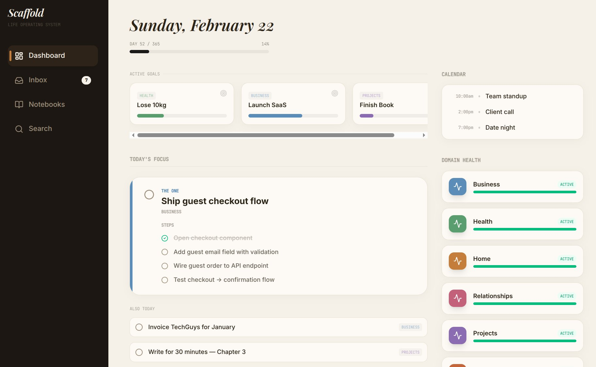
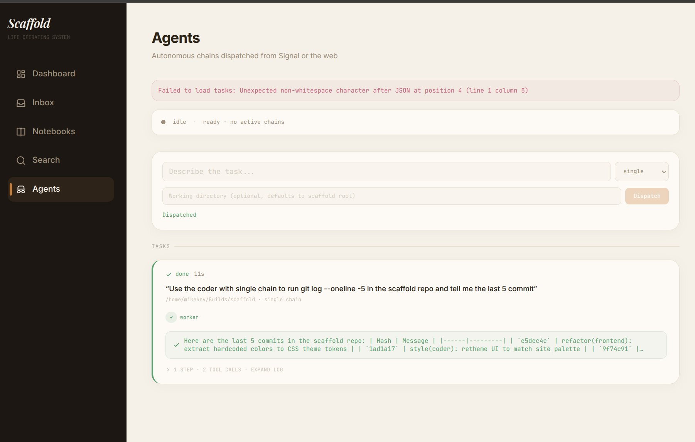

# Scaffold

Agentic executive function for people with ADHD.

Your brain drops things. Scaffold catches them.

Scaffold is a personal AI system that replaces the executive function layer most productivity tools assume you already have. It captures, triages, prioritizes, and surfaces what matters — so you don't have to hold it all in your head.

Not a todo app. Not a second brain. An agent that actually does the cognitive work you can't.

## What It Does

- **Captures anywhere** — text it a thought via Signal, it figures out what to do with it
- **Triages automatically** — incoming captures get classified, prioritized, and routed without you deciding
- **Maintains itself** — background processes consolidate, decay, and prune so entropy doesn't win
- **Surfaces what matters** — a dashboard built around what you should focus on *right now*, not everything you've ever saved
- **Remembers context** — a knowledge graph that connects your goals, tasks, notes, and conversations across life domains
- **Delegates work** — dispatch coding tasks to an agent chain that scouts, plans, builds, and reviews

## Screenshots

| Dashboard | Agents |
|-----------|--------|
|  |  |

## How It Works

Five surfaces share one SQLite brain:

| Surface | What it does |
|---------|-------------|
| **Signal Agent** | Conversational AI assistant via Signal. Captures thoughts, answers questions, manages goals/tasks — all through text messages. |
| **Desktop** | Lightweight web UI — dashboard, inbox, notebooks, search, and a live agent pipeline view. |
| **Cortex** | Background scheduler that synthesizes context, decays stale info, consolidates duplicates, and detects domain drift. |
| **Session Bus** | Cross-agent messaging so surfaces can coordinate. |
| **Worker** | Runs multi-step coding chains (scout → plan → build → review) triggered from Signal or the UI. |

## Stack

Go daemon · SQLite · Preact + Tailwind frontend · Signal for messaging · Multi-provider LLM routing (Anthropic, OpenAI, Ollama) · Ollama embeddings · Google Calendar integration

## Life Domains

Scaffold organizes everything into life domains — Health, Career, Creative, etc. Each domain tracks:

- **Goals** — binary (done/not done), measurable (progress toward a target), or habits (recurring)
- **Tasks** — with recurring support and completion logging
- **Notes** — freeform, tagged, searchable
- **Health** — automatic drift detection flags domains going cold or getting neglected

## The Desk

The desk is intentionally constrained to **3 items max**. Position 1 is THE ONE thing to focus on. Positions 2-3 are next up. The cortex populates it via LLM prioritization so you don't have to decide what's most important — it tells you.

## Quick Start

### Prerequisites

- Go 1.25+
- Bun (frontend)
- signal-cli (Signal bridge)
- Ollama (embeddings)

### Run

```bash
# Backend
cd daemon
cp .env.example .env  # fill in your keys
go build -o bin/scaffold-daemon .
./bin/scaffold-daemon

# Frontend
cd app
bun install
bun run dev
```

### Services (systemd)

```bash
systemctl --user restart scaffold-daemon.service
systemctl --user restart scaffold-signal-cli.service
journalctl --user -u scaffold-daemon.service -f   # tail logs
curl -sS http://127.0.0.1:46873/api/health        # health check
```

## Configuration

All config lives in `config/` as YAML files. Secrets live in `daemon/.env`. The key one is `config/llm.yaml` — it controls which LLM provider and model handles each part of the system (conversation, triage, cortex tasks, etc.). Swap providers per-route without touching code.

## Project Layout

```
app/                  # Preact + Vite + Tailwind frontend
daemon/               # Go daemon (single binary does everything)
config/               # YAML config files + agent chain prompts
docs/                 # Architecture and planning docs
specs/                # Implementation specs
```

## Status

Core system is operational. Signal agent, web desktop, cortex scheduler, session bus, and worker chains are all live. Currently working on hybrid memory search (FTS5 + vector retrieval) and Gmail triage integration.

## License

Personal project. Not open source (yet).
